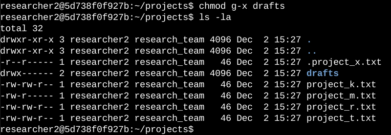

<h1>Project Description</h1>

The research team at my <b>hypothethical</b> organization needs to update the file permissions for certain files and directories within the projects directory. The permissions do not currently reflect the level of authorization that should be given. Checking and updating these permissions will help keep their system secure.  See the attached current file permissions of in the document file.

<h2>Tasks Performed</h2>

To complete this task, I performed the following tasks:

<ol>
  <li><strong><h3>Check file and directory details:</h3></strong></li>
</ol>

 
 I used Linux commands to determine the existing permissions set for a specific directory in the file system.

The following code demonstrates how I accomplished this:

  

 

The first line of the screenshot displays the command I entered, and the other lines display the output. The code lists all contents of the projects directory. I used the `ls` command with the `-la` option to display a detailed listing of the file contents that also returned hidden files. The output of my command indicates that there is one directory named "drafts," one hidden file named ".project_x.txt," and five other project files. The 10-character string in the first column represents the permissions set on each file or directory.

 
<ol start="2">
  <li><strong><h3>Description of the permission strings:</h3></strong></li>
</ol>

The 10-character string can be deconstructed to determine who is authorized to access the file and their specific permissions. The characters and what they represent are as follows:

<ul>
  <li><strong>1st character:</strong> This character is either a `d` or hyphen (`-`) and indicates the file type. If it’s a `d`, it’s a directory. If it’s a hyphen (`-`), it’s a regular file.</li>
  <li><strong>2nd-4th characters:</strong> These characters indicate the read (`r`), write (`w`), and execute (`x`) permissions for the user. When one of these characters is a hyphen (`-`) instead, it indicates that this permission is not granted to the user.</li>
  <li><strong>5th-7th characters:</strong> These characters indicate the read (`r`), write (`w`), and execute (`x`) permissions for the group. When one of these characters is a hyphen (`-`) instead, it indicates that this permission is not granted for the group.</li>
  <li><strong>8th-10th characters:</strong> These characters indicate the read (`r`), write (`w`), and execute (`x`) permissions for others. This owner type consists of all other users on the system apart from the user and the group. When one of these characters is a hyphen (`-`) instead, it indicates that this permission is not granted for others.</li>
</ul>

For example, the file permissions for `project_t.txt` are `-rw-rw-r--`. Since the first character is a hyphen (`-`), this indicates that `project_t.txt` is a file, not a directory. The second, fifth, and eighth characters are all `r`, which indicates that the user, group, and others all have read permissions. The third and sixth characters are `w`, which indicates that only the user and group have write permissions. No one has execute permissions for `project_t.txt`.

 

<ol start="3">
  <li><strong><h3>Changing file permissions:</h3></strong></li>
</ol>

The organization determined that other shouldn't have write access to any of their files. To comply with this, I referred to the file permissions that I previously returned. I determined project_k.txt must have the write access removed for other.

The following code demonstrates how I used Linux commands to do this:

  

 
The first two lines of the screenshot display the commands I entered, and the other lines display the output of the second command. The `chmod` command changes the permissions on files and directories. The first argument indicates what permissions should be changed, and the second argument specifies the file or directory. In this example, I removed write permissions from `other` for the `project_k.txt` file. After this, I used the following command to review the updates I made:

 
 
<ol start="4">
  <li><strong><h3>Changing file permissions on a hidden file:</h3></strong></li>
</ol>

The research team at my organization recently archived project_x.txt. They do not want anyone to have write access to this project, but the user and group should have read access. 

The following code demonstrates how I used Linux commands to change the permissions:

  

 

The first two lines of the screenshot display the commands I entered, and the other lines display the output of the second command. I know .project_x.txt is a hidden file because it starts with a period (.). In this example, I removed write permissions from the user and group, and added read permissions to the group. I removed write permissions from the user with u-w. Then, I removed write permissions from the group with g-w, and added read permissions to the group with g+r. 
 
 
<ol start="5">
  <li><strong><h3>Changing directory permissions:</h3></strong></li>
</ol>

My organization only wants the researcher2 user to have access to the drafts directory and its contents. This means that no one other than researcher2 should have execute permissions.

The following code demonstrates how I used Linux commands to change the permissions:

  

 

The first two lines of the screenshot display the commands I entered, and the other lines display the output of the second command. I previously determined that the group had execute permissions, so I used the chmod command to remove them. The researcher2 user already had execute permissions, so they did not need to be added.
 
 
<ol start="6">
  <li><strong><h3>Summary:</h3></strong></li>
</ol>

I changed multiple permissions to match the level of authorization my organization wanted for files and directories in the projects directory. The first step in this was using ls -la to check the permissions for the directory. This informed my decisions in the following steps. I then used the chmod command multiple times to change the permissions on files and directories.

